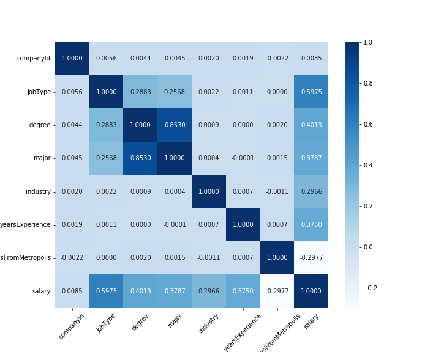

# Salary Predictions Based on Job Descriptions
## Foreword
This project is conducted based on one of the suggestions from [Data Science Dream Job](https://www.datasciencedreamjob.com) (DSDJ) program 
to enhance the process of self learning and start building a personal portfolio. Given data using in this project are also provided
from DSDJ. In this project, the main process which is recommended by DSDJ Team to conduct a data science project is utilized, but as the 
main objective of this assignment is learning, so in several parts there are still scatter things for cross check purpose. Especially the
visualization part, which had been lacked in the first attemp to conduct EDA, was implemented later based on the reference of DSDJ Team's solution.  

## Part 1 - DEFINE
### ---- 1.1 Define the problem ----

Salary of a given position which is characterised through several features e.g. job type, required degree, 
years of experience etc. As it is expected that there are correlations and associations between these features 
and the salary of the corresponding position, it is possible to develop a model to predict salary value based on
given related features' values. 

To develop a model these are key issues relating to the data and models needed to be considered:
1. Are there correlation or association between given features and salary value? 
   How can we illustrated these ones? - through correlation coefficients incase of numerical 
   (what should be check in case of categorial data) / charts (scatter/line?)
2. Content and quality of data: which types of data are available (format, scale, numerical or categorical etc.)
   / consideration of required transformation (if applicable) or approach to handle missing values or technical 
   collecting problem / appropriate feature engineering techniques for these corresponding inputs - outputs.
3. Which models are approrpiate to this regression problems, especially in terms of limited computational resources 
   and large dataset, as well as the issues of hyperparameter tuning?
 
 ### ---- 1.2 Description of given data ----
 Given data including three files:
 1. train_features.csv:this file contains eight characteristics of one million employed positions, 
                       including jobId, companyId, jobType, degree, major, industry, yearsExperience 
                       and milesFromMetropolis. jobId is used as an identification number of a position. 
 2. train_salaries: this file contains the salary of the corresponding one million positions in train_features.csv file.
                    There are two columns including jobId and salary. jobId is also used as an identification number of
                    a position.
 3. test_features.csv: this file share the same structure as the train_features.csv file with eight columns for eight
                       characteristics but with different one million positions. The final objective of this assignment is
                       to predict the salary of these positions based on given information in this file.

### ---- 1.3 Used technology & tools ----
This project is implemented by using Python with Jupyter notebook on the cloud platform AWS Sagemaker. Most of parts in this [notebook](./Salary_Prediction.ipynb)
can be executed also with Google Colab, but the performance of both platforms on the part relating to Random Forest Cross-Validation are not stable.  

## Part 2 - DISCOVER
In this phase, standard process of data wrangling is applied to get the first understanding of availabe data and prepare it for building models in the next step.
### ---- 2.1. Load data from csv file into pandas dataframe ---- ###

### ---- 2.2. Get basic information relating to number of features, names of features, datatype and relating descriptive statistics ---- ###
Here is a brief description of features in studied data
|Feature|Type|Description|
|-------|----|-----------|
|jobId|Categorical|Identification number of each position, unique value by each row|
|companyId|Categorical|Identification number of the company which the position belongs to|
|jobType|Categorical|Hierarchy levels e.g Junior/Manager/CFO/CEO etc.|
|degree|Categorical|Highest level of education e.g. None/Highschool/Master etc.|
|major|Categorical|Major of fields e.g. Business/Biologie/Math etc.|
|industry|Categorical|Main operation industry of the company e.g Web/Auto/Finance etc.|
|yearsExperience|Numerical|Years of experience of the employee|
|milesFromMetroplis|Numerical|Distance between working company and Metropolis|

### ---- 2.3. Data is examined in detail ---- ###
To check if there are duplications, missing values, inappropriate values by each feature. It is also essential to check if the features in
test file are all similar to those in train file, as well as the value ranges or set of categorical values. As in case of the prediction on test data requires extrapolation from trained data, the selection of models should take this into consideration. Moreover, the potential outliers are also detected and examnied
if they are ligitimated data or they should be removed.

In this data set, there is not any duplication or missing values, but there are five records which have salary value = 0. These are removed as these data does not have any indication that it includes any volunteer positions. So those ones with salary = 0 are probably caused by input mistake or technical collection problem.

The popular rule with 1.5IQR is applied to identify potential outliers. However those values which are greater then the upper bound belongs mostly to C-level positions or popular high salary industry like Auto/Finance etc. Thus they are considered as ligitimate ones and kept in the train data.  

### ---- 2.4 Correlations and Associations between target and features and between features as well are checked.
Besides the pairwise relationships between target and each feature are illustrated, the correlation matrix are presented as heatmap with correlation coefficient values to quantify the magnitude of these correlations. In this part an important learning point gained from the approach of DSDJ Team to apply
is the Target Encoding for categorical variables to enable the effective standard correlation check between different types of features (numerical & categorical).
 
This matrix shows clearly that there is a strong correlation between jobType and salary. Moreover, there are also moderate correlations between salary and degree, major, yearsExperience, industry and milesFromMetropolis. A strong correlation between major and degree exist also. Furthermore, as the correlation of salary and companyId is extremely low which indicates a weak association between them, this feature can be removed from the features using to build a prediction model.

### ---- 2.5 Establish a baseline model with appropriate metric to compare performance among different models

## Part 3 - DEVELOP
